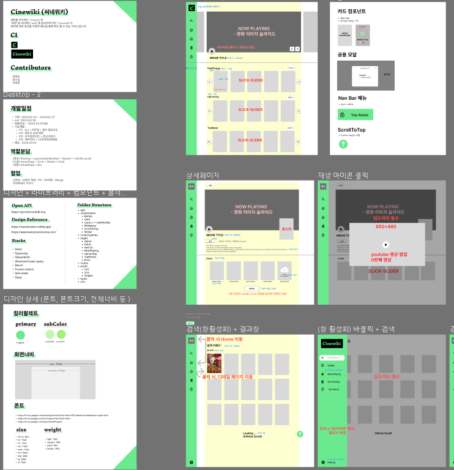

## 영화에 대한 모든 정보는   Cinewiki (씨네위키)

### 💫 프로젝트 소개

---

- 영화를 의미하는 "cinema🎞️"와 “빠른⚡”을 의미하는"wiki"를 합성하여 만든 "Cinewiki"는 영화에 대한 정보를 다양한 메뉴를 통해 확인 할 수 있는 서비스입니다.

### 📝 지원 기능

- 영화 정보 조회 (공용 모달처리)
- 영화 리스트 보기 (무한 스크롤)
- 영화 검색 기능

### 📅프로젝트 기한 및 내용

2024.2.28 ~ 2024.3.13 (+이후 리팩토링 진행)

### 😄 팀원 구성

    <table style="margin-left: auto; margin-right: auto;">
      <tr>
        <td>
            
        </td>
        <td>
               
        </td>
        <td>
           
        </td>
      </tr>
      <tr>
        <th>장영승</th>
        <th>이재훈</th>
        <th>김나실</th>
      </tr>
      <tr>
        <th style="color:dodgerblue">Frontend</th>
        <th style="color:dodgerblue">Frontend</th>
        <th style="color:dodgerblue">Frontend</th>
      </tr>
 <tr>
        <th>레이아웃,검색,무한스크롤</th>
        <th>상세페이지</th>
        <th>메인페이지,modal</th>
      </tr>
    </table>

 

### 🎥 주요 기능 영상

<table style="text-align: center">
  <tr>
    <td>
      
    </td>
    <td>
      
    </td>
  </tr>
   <tr>
    <th>
      무한 스크롤
    </th>
    <th>
      상세 페이지
    </th>
  </tr>
 <tr>
    <td>
      
    </td>
    
  </tr>
   </tr>
   <tr>
    <th>
      영화 검색
    </th>
    
  </tr>
</table>

 

### 📊 Stacks

| Environment                                                                                                       | 사용                                 |
| ----------------------------------------------------------------------------------------------------------------- | ------------------------------------ |
| [ Communication ]                                                                                                 |                                      |
|               | gitHub                               |
|             | discord                              |
|                                               | Notion                               |
| [ tools ]                                                                                                         |                                      |
|                 | 디자인                               |
|                     | Config                               |
| [ Language ]                                                                                                      |                                      |
|                                                   | 타입스크립트                         |
| [ Library ]                                                                                                       |                                      |
|    | api call, 백엔드 데이터 연결 및 관리 |
|  | 라우팅 연결                          |
|                                                               | 전역 상태 관리                       |
|                                                               | 전역 상태 관리                       |
|                                                               | 전역 상태 관리                       |

### 📌 기획과정

#### 디자인 - Figma

- 화면 디자인 개발과 원활한 협업를 위해 Figma에서 디자인과 기획 작업을 진행하였습니다.
- <a href="https://www.figma.com/file/LStbG51DcKnzpWTxhNrTyZ/TS-MovieTrailer?type=design&node-id=0%3A1&mode=design&t=NbVgc7WKew1sh85Y-1">피그마 링크</a>

#### Github 협업

- Pull request > PR Review(팀원 전원 Approve) > Merge 방식으로 진행

   
